# ObjectQL Architecture Diagrams

This document contains visual representations of the ObjectQL architecture and proposed improvements.

## Current Architecture

### Micro-Kernel Plugin System

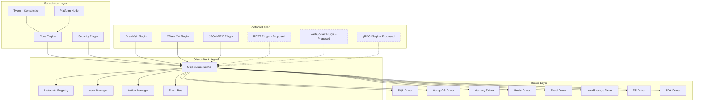

### Current Data Flow

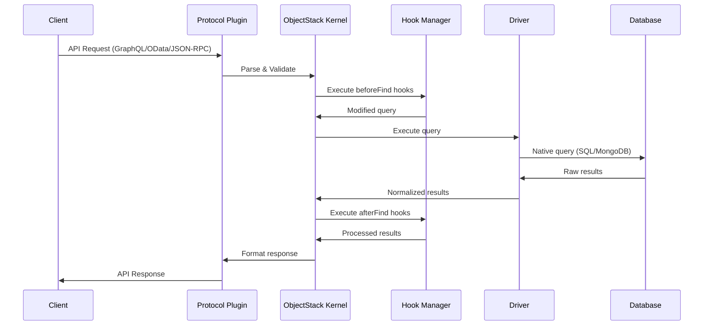

## Proposed Architecture Improvements

### Optimized Metadata Registry

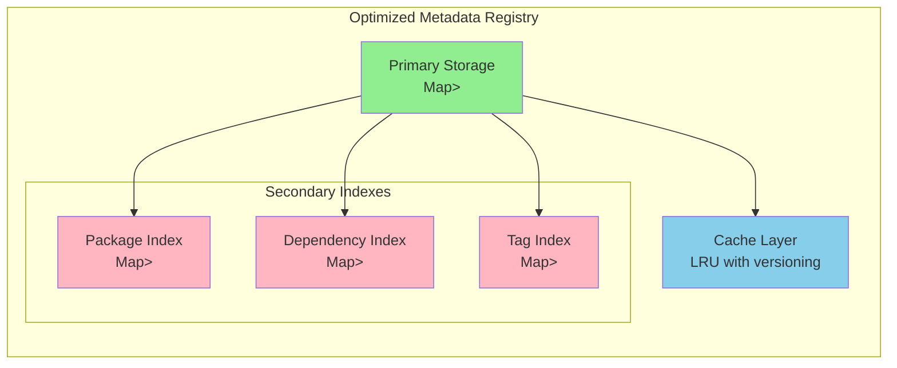

### Compiled Hook Pipeline

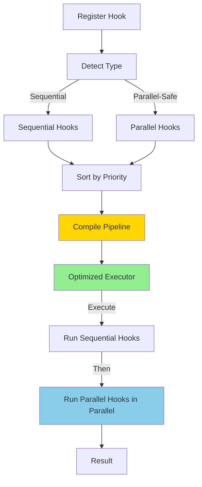

### Query Plan Compilation & Caching

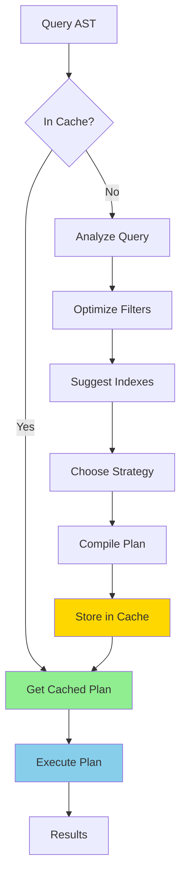

### Connection Pool Architecture

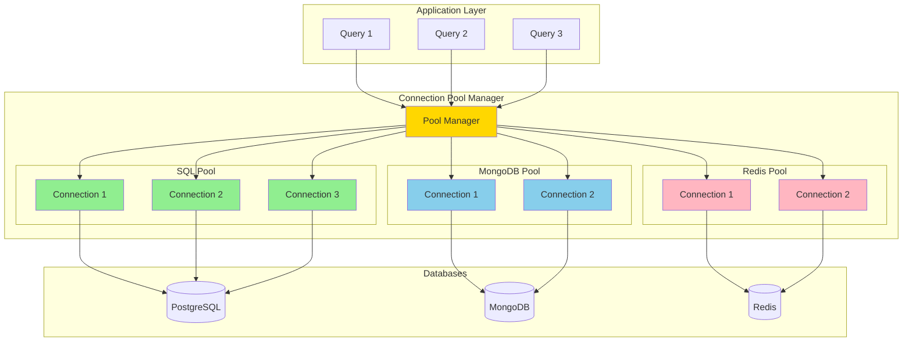

## Plugin Ecosystem Architecture

### Plugin Development Lifecycle

```mermaid
graph LR
    subgraph "Development"
        I[Idea] --> G[Generate Scaffold]
        G --> C[Code Plugin]
        C --> T[Write Tests]
    end
    
    subgraph "Testing"
        T --> U[Unit Tests]
        U --> INT[Integration Tests]
        INT --> P[Performance Tests]
    end
    
    subgraph "Publishing"
        P --> V[Version]
        V --> D[Document]
        D --> PUB[Publish to npm]
    end
    
    subgraph "Distribution"
        PUB --> R[Registry]
        R --> DIS[Discovery]
        DIS --> INST[Installation]
    end
    
    style G fill:#FFD700
    style T fill:#90EE90
    style PUB fill:#87CEEB
    style R fill:#FFB6C1
```

### Plugin Dependency Graph

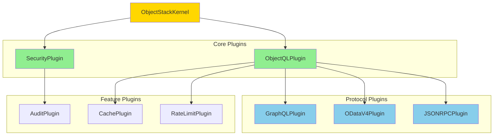

## Enterprise Architecture

### Multi-Tenant Architecture

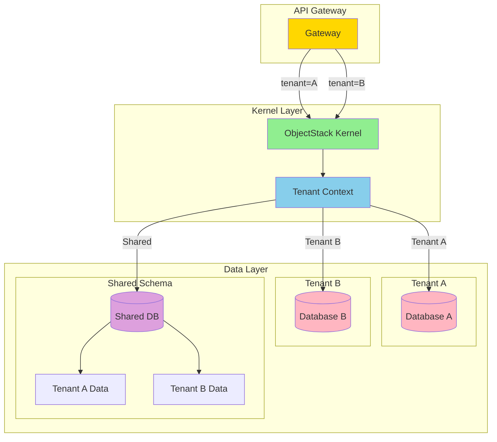

### High Availability Architecture

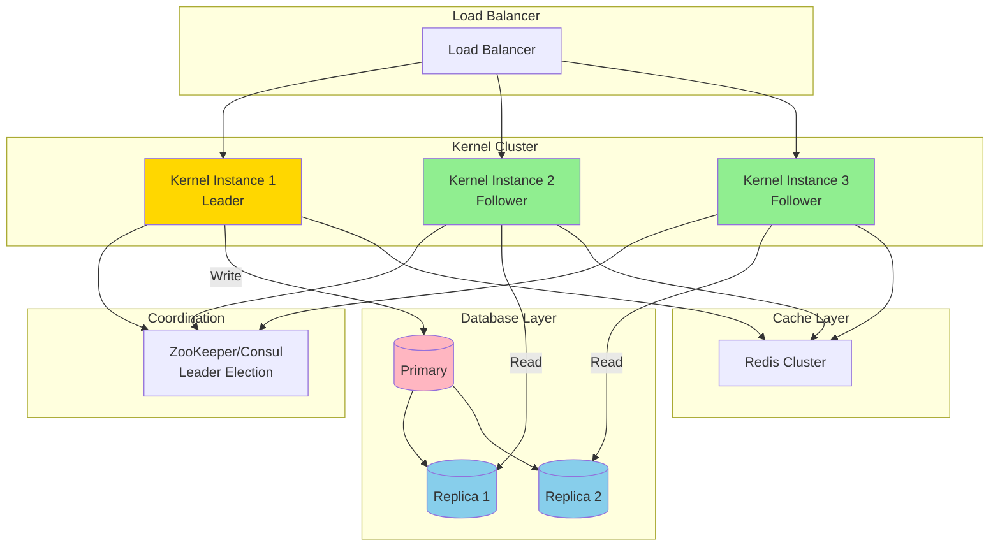

### Observability Stack

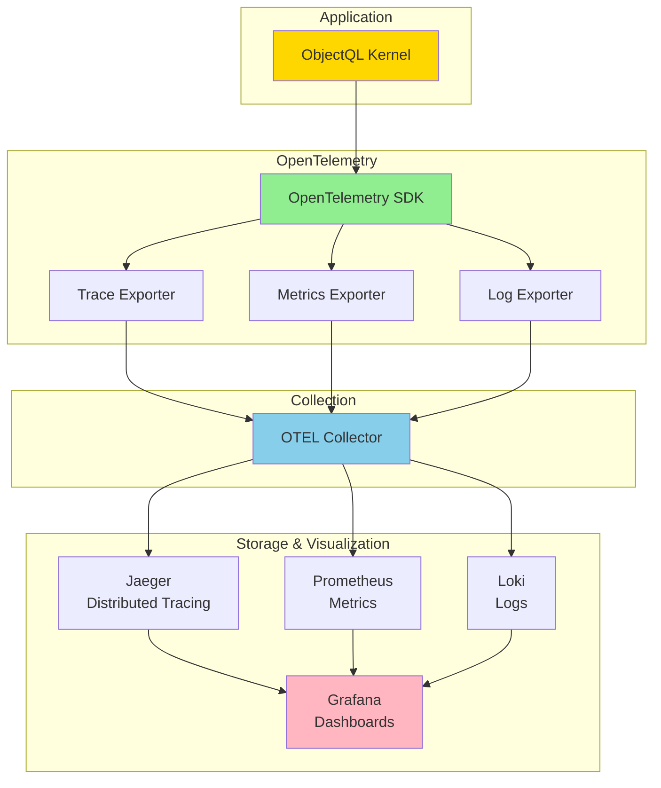

## AI-Powered Features Architecture

### Query Optimization AI

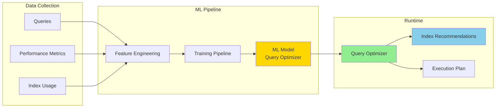

### Schema Evolution AI

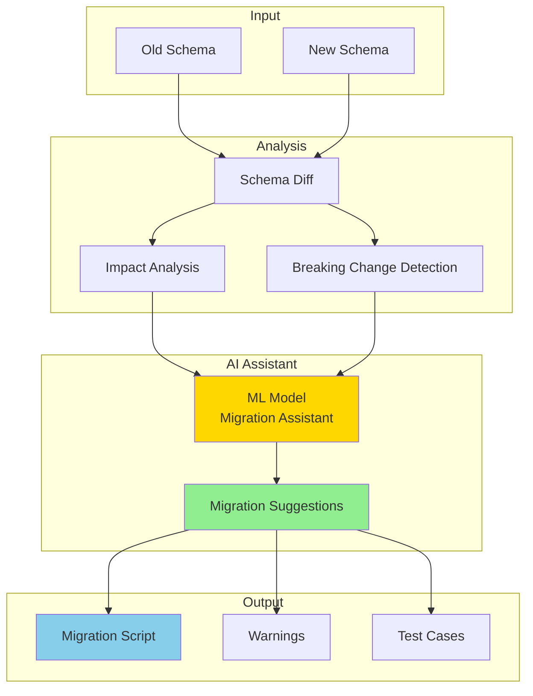

## Development Roadmap Timeline

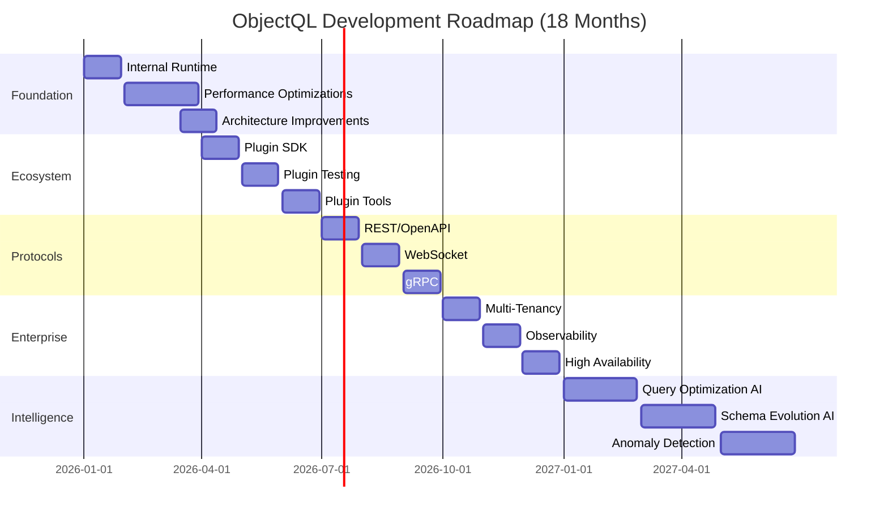

## Performance Improvement Targets

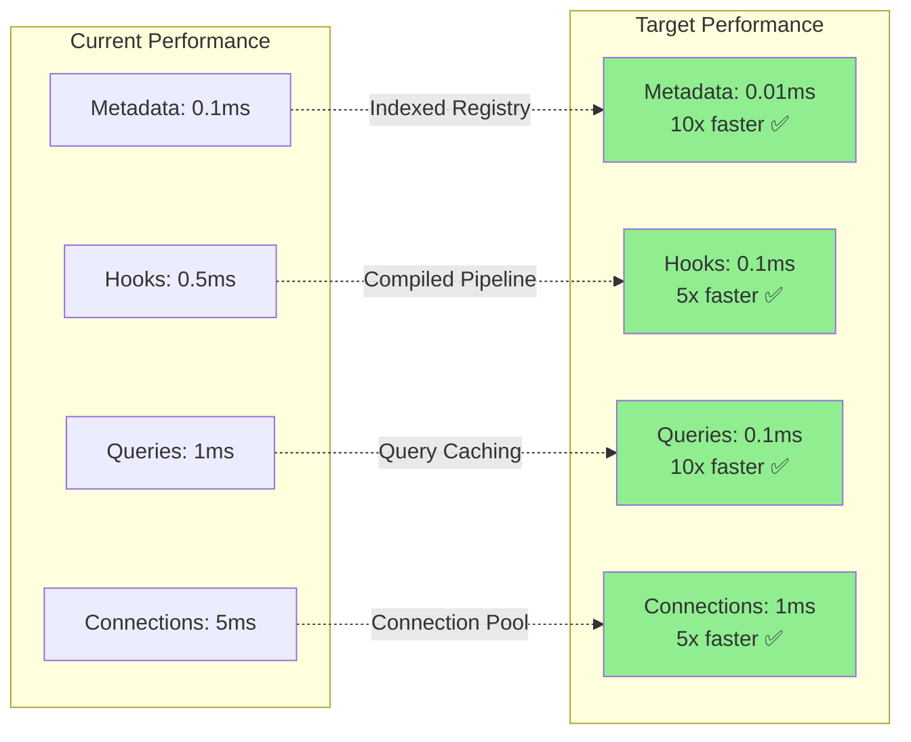

---

## Notes

These diagrams illustrate:

1. **Current Architecture** - The existing micro-kernel plugin system
2. **Proposed Optimizations** - Performance improvements for metadata, hooks, queries, and connections
3. **Plugin Ecosystem** - Development lifecycle and dependency management
4. **Enterprise Features** - Multi-tenancy, high availability, and observability
5. **AI Integration** - Query optimization and schema evolution
6. **Roadmap Timeline** - 18-month development plan

All diagrams are in Mermaid format for easy rendering on GitHub and in documentation tools.
