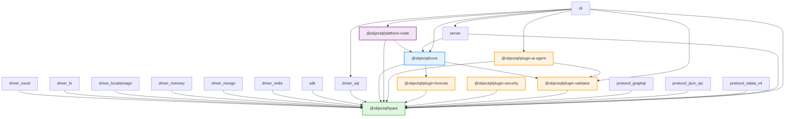

# ObjectQL Dependency Graph

**Generated**: 2026-01-31T03:04:02.140Z

## Visual Representation

## Analysis Summary

- **Total Packages**: 22
- **Circular Dependencies**: None detected ✅
- **External Dependencies**: 4 unique packages

## External Dependencies

### @objectstack/core

- **Versions**: ^0.6.1
- **Used by**: 4 package(s)
    - @objectql/core
  - @objectql/plugin-formula
  - @objectql/plugin-security
  - @objectql/plugin-validator

### @objectstack/objectql

- **Versions**: ^0.6.1
- **Used by**: 2 package(s)
    - @objectql/core
  - @objectql/types

### @objectstack/runtime

- **Versions**: ^0.6.1
- **Used by**: 1 package(s)
    - @objectql/core

### @objectstack/spec

- **Versions**: ^0.6.1
- **Used by**: 14 package(s)
    - @objectql/driver-excel
  - @objectql/driver-fs
  - @objectql/driver-localstorage
  - @objectql/driver-memory
  - @objectql/driver-mongo
  - @objectql/driver-redis
  - @objectql/sdk
  - @objectql/driver-sql
  - @objectql/core
  - @objectql/platform-node
  - @objectql/types
  - @objectql/protocol-graphql
  - @objectql/protocol-json-rpc
  - @objectql/protocol-odata-v4

## Package Details

### @objectql/cli (v4.0.2)

**Path**: `packages/tools/cli/package.json`

**Internal Dependencies** (7):
- @objectql/types (workspace:*)
- @objectql/core (workspace:*)
- @objectql/plugin-validator (workspace:*)
- @objectql/plugin-ai-agent (workspace:*)
- @objectql/server (workspace:*)
- @objectql/driver-sql (workspace:*)
- @objectql/platform-node (workspace:*)

**External Dependencies** (0):
- None

### @objectql/core (v4.0.2)

**Path**: `packages/foundation/core/package.json`

**Internal Dependencies** (3):
- @objectql/types (workspace:*)
- @objectql/plugin-formula (workspace:*)
- @objectql/plugin-validator (workspace:*)

**External Dependencies** (4):
- @objectstack/spec (^0.6.1)
- @objectstack/runtime (^0.6.1)
- @objectstack/objectql (^0.6.1)
- @objectstack/core (^0.6.1)

### @objectql/create (v4.0.2)

**Path**: `packages/tools/create/package.json`

**Internal Dependencies** (0):
- None

**External Dependencies** (0):
- None

### @objectql/driver-excel (v4.0.2)

**Path**: `packages/drivers/excel/package.json`

**Internal Dependencies** (1):
- @objectql/types (workspace:*)

**External Dependencies** (1):
- @objectstack/spec (^0.6.1)

### @objectql/driver-fs (v4.0.2)

**Path**: `packages/drivers/fs/package.json`

**Internal Dependencies** (1):
- @objectql/types (workspace:*)

**External Dependencies** (1):
- @objectstack/spec (^0.6.1)

### @objectql/driver-localstorage (v4.0.2)

**Path**: `packages/drivers/localstorage/package.json`

**Internal Dependencies** (1):
- @objectql/types (workspace:*)

**External Dependencies** (1):
- @objectstack/spec (^0.6.1)

### @objectql/driver-memory (v4.0.2)

**Path**: `packages/drivers/memory/package.json`

**Internal Dependencies** (1):
- @objectql/types (workspace:*)

**External Dependencies** (1):
- @objectstack/spec (^0.6.1)

### @objectql/driver-mongo (v4.0.2)

**Path**: `packages/drivers/mongo/package.json`

**Internal Dependencies** (1):
- @objectql/types (workspace:*)

**External Dependencies** (1):
- @objectstack/spec (^0.6.1)

### @objectql/driver-redis (v4.0.2)

**Path**: `packages/drivers/redis/package.json`

**Internal Dependencies** (1):
- @objectql/types (workspace:*)

**External Dependencies** (1):
- @objectstack/spec (^0.6.1)

### @objectql/driver-sql (v4.0.2)

**Path**: `packages/drivers/sql/package.json`

**Internal Dependencies** (1):
- @objectql/types (workspace:*)

**External Dependencies** (1):
- @objectstack/spec (^0.6.1)

### @objectql/platform-node (v4.0.2)

**Path**: `packages/foundation/platform-node/package.json`

**Internal Dependencies** (2):
- @objectql/core (workspace:*)
- @objectql/types (workspace:*)

**External Dependencies** (1):
- @objectstack/spec (^0.6.1)

### @objectql/plugin-ai-agent (v4.0.2)

**Path**: `packages/foundation/plugin-ai-agent/package.json`

**Internal Dependencies** (2):
- @objectql/types (workspace:*)
- @objectql/plugin-validator (workspace:*)

**External Dependencies** (0):
- None

### @objectql/plugin-formula (v4.0.2)

**Path**: `packages/foundation/plugin-formula/package.json`

**Internal Dependencies** (1):
- @objectql/types (workspace:*)

**External Dependencies** (1):
- @objectstack/core (^0.6.1)

### @objectql/plugin-security (v4.0.2)

**Path**: `packages/foundation/plugin-security/package.json`

**Internal Dependencies** (1):
- @objectql/types (workspace:*)

**External Dependencies** (1):
- @objectstack/core (^0.6.1)

### @objectql/plugin-validator (v4.0.2)

**Path**: `packages/foundation/plugin-validator/package.json`

**Internal Dependencies** (1):
- @objectql/types (workspace:*)

**External Dependencies** (1):
- @objectstack/core (^0.6.1)

### @objectql/protocol-graphql (v0.1.0)

**Path**: `packages/protocols/graphql/package.json`

**Internal Dependencies** (1):
- @objectql/types (workspace:*)

**External Dependencies** (1):
- @objectstack/spec (^0.6.1)

### @objectql/protocol-json-rpc (v0.1.0)

**Path**: `packages/protocols/json-rpc/package.json`

**Internal Dependencies** (1):
- @objectql/types (workspace:*)

**External Dependencies** (1):
- @objectstack/spec (^0.6.1)

### @objectql/protocol-odata-v4 (v0.1.0)

**Path**: `packages/protocols/odata-v4/package.json`

**Internal Dependencies** (1):
- @objectql/types (workspace:*)

**External Dependencies** (1):
- @objectstack/spec (^0.6.1)

### @objectql/sdk (v4.0.2)

**Path**: `packages/drivers/sdk/package.json`

**Internal Dependencies** (1):
- @objectql/types (workspace:*)

**External Dependencies** (1):
- @objectstack/spec (^0.6.1)

### @objectql/server (v4.0.2)

**Path**: `packages/runtime/server/package.json`

**Internal Dependencies** (2):
- @objectql/core (workspace:*)
- @objectql/types (workspace:*)

**External Dependencies** (0):
- None

### @objectql/types (v4.0.2)

**Path**: `packages/foundation/types/package.json`

**Internal Dependencies** (0):
- None

**External Dependencies** (2):
- @objectstack/spec (^0.6.1)
- @objectstack/objectql (^0.6.1)

### vscode-objectql (v4.0.0)

**Path**: `packages/tools/vscode-objectql/package.json`

**Internal Dependencies** (0):
- None

**External Dependencies** (0):
- None

