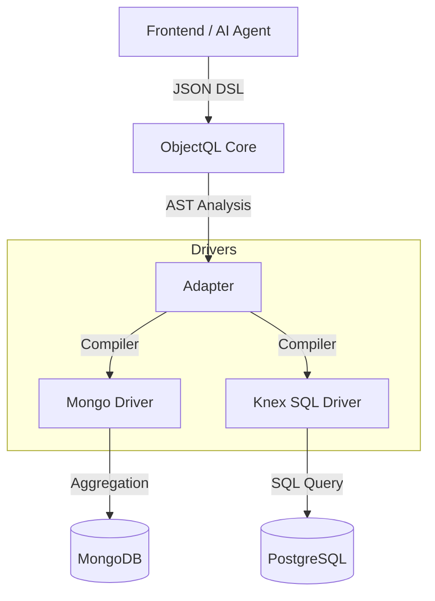

# ObjectQL

**One Protocol, Any Database, AI-Ready.**

A universal data query engine for the modern stack.

Write your logic once in JSON-DSL, run it seamlessly on MongoDB (Schema-less) or PostgreSQL (Schema-strict).

---

## 📖 Introduction

**ObjectQL** is a standalone, open-source query engine designed to bridge the gap between flexible design and structured storage.

In modern application development, developers often face a dilemma:

1. **Design Phase:** You want the flexibility of **NoSQL (MongoDB)** to iterate fast, change schemas on the fly, and handle dynamic fields.
2. **Production Phase:** You need the reliability, transactions, and reporting capabilities of **SQL (PostgreSQL)**.

ObjectQL solves this by providing a unified **JSON-DSL (Domain Specific Language)**. It acts as a transpiler that compiles your abstract query logic into optimized native queries for whichever database you are running on.

It is **not** an ORM, but a high-level data protocol designed for AI agents, low-code engines, and dynamic API layers.

## ✨ Key Features

* **🚀 Dual-Stack Engine:**
* **Mongo Driver:** Native performance for schema-less data and rapid prototyping.
* **Knex SQL Driver:** First-class support for PostgreSQL, MySQL, and SQLite. It uniquely employs a "Core Columns + JSONB" strategy to handle dynamic fields within a relational structure.


* **🤖 AI-Native Protocol:**
* Queries are defined as standardized **JSON ASTs** (Abstract Syntax Trees), not string concatenation.
* This structure is optimized for LLMs (like ChatGPT/Claude) to understand schema and generate accurate, safe business logic without hallucinating SQL syntax.


* **✅ Metadata-Driven Validation:**
* Define validation rules declaratively in YAML/JSON metadata.
* Support for field-level, cross-field, and state machine validation.
* Configurable severity levels (error, warning, info) and triggers (create, update, delete).
* Template messages with internationalization support.


* **📝 Clean, Minimal Syntax:**
* **Filename-based identification** - No redundant `name` properties needed
* Object name automatically inferred from `project.object.yml` → `project`
* 10-15% less boilerplate compared to traditional metadata formats
* Crystal-clear file organization and conventions


* **⚡ Modern & Lightweight:**
* Written in 100% **TypeScript**.
* **Zero heavy legacy dependencies.** No runtime environment requirements beyond Node.js.
* Promise-based asynchronous API.


* **🔌 Pluggable Architecture:**
* The core logic is completely decoupled from storage drivers.
* Easily extensible to support other data sources (e.g., REST APIs, GraphQL, SQLite).

* **🌐 Universal Server:**
* Built-in HTTP adapter (`@objectql/server`) to run anywhere (Node, Express, Next.js).
* Standardized JSON API for CRUD and Actions.

* **🎨 Web Console:**
* Beautiful web-based admin interface for database management.
* Browse objects, view data grids, perform CRUD operations.
* Schema inspector to view object definitions and field metadata.
* Modern, responsive design with intuitive navigation.

## 📦 Installation

```bash
# Install the core engine
npm install @objectql/core

# Install drivers as needed
npm install @objectql/driver-mongo
npm install @objectql/driver-sql

```

## ⚡ Quick Start

### 1. Initialize ObjectQL

```typescript
import { ObjectQL } from '@objectql/core';
import { MongoDriver } from '@objectql/driver-mongo';
import { KnexDriver } from '@objectql/driver-sql';

const app = new ObjectQL({
  datasources: {
    // Environment A: Cloud / Prototype (MongoDB)
    design: new MongoDriver({ url: process.env.MONGO_URL }),
    
    // Environment B: On-Premise / Production (PostgreSQL)
    runtime: new KnexDriver({ client: 'pg', connection: process.env.PG_URL })
  }
});

```

### 2. The Unified Query (JSON-DSL)

This syntax is consistent regardless of the underlying database. It is designed to be easily generated by frontend UI builders or AI agents.

```typescript
// Example: Find orders with amount > 1000 and expand customer details
const query = {
  entity: 'orders',
  fields: ['id', 'order_no', 'amount', 'created_at'],
  filters: [
    ['status', '=', 'paid'],
    'and',
    ['amount', '>', 1000]
  ],
  sort: [['created_at', 'desc']],
  expand: {
    customer: {
      fields: ['name', 'email']
    }
  }
};

// Option A: Execute on MongoDB
// ObjectQL compiles this to an Aggregation Pipeline
const resultsMongo = await app.datasource('design').find(query);

// Option B: Execute on PostgreSQL
// ObjectQL compiles this to a SQL query with JSONB operators and JOINs
const resultsSql = await app.datasource('runtime').find(query);

```

Both queries return the same results, but the underlying native query is optimized for MongoDB or PostgreSQL.

### 3. Formulas & Validation

ObjectQL supports powerful formulas and validation rules. Define calculated fields and business rules declaratively:

```typescript
import { ObjectConfig, Validator } from '@objectql/core';
import { ValidationContext } from '@objectql/types';

// Define object with formulas and validation rules
const projectObject: ObjectConfig = {
    name: 'project',
    fields: {
        // Regular field
        name: { 
            type: 'text', 
            required: true,
            validation: {
                min_length: 3,
                max_length: 100,
                pattern: '^[a-zA-Z0-9\\s]+$'
            }
        },
        // Calculated field (formula)
        profit: {
            type: 'formula',
            expression: 'revenue - cost',
            data_type: 'currency'
        },
        email: {
            type: 'email',
            validation: {
                format: 'email',
                message: 'Please enter a valid email address'
            }
        },
        start_date: { type: 'date' },
        end_date: { type: 'date' },
        status: { 
            type: 'select', 
            options: [
                { label: 'Planning', value: 'planning' },
                { label: 'Active', value: 'active' },
                { label: 'Completed', value: 'completed' }
            ]
        }
    },
    validation: {
        rules: [
            // Cross-field validation
            {
                name: 'valid_date_range',
                type: 'cross_field',
                rule: {
                    field: 'end_date',
                    operator: '>=',
                    compare_to: 'start_date'
                },
                message: 'End date must be on or after start date',
                error_code: 'INVALID_DATE_RANGE'
            },
            // State machine validation
            {
                name: 'status_transition',
                type: 'state_machine',
                field: 'status',
                transitions: {
                    planning: { allowed_next: ['active', 'cancelled'] },
                    active: { allowed_next: ['completed', 'cancelled'] },
                    completed: { allowed_next: [], is_terminal: true }
                },
                message: 'Invalid status transition'
            }
        ]
    }
};

// Execute validation programmatically
const validator = new Validator({ language: 'en' });

const result = await validator.validate(
    projectObject.validation.rules,
    {
        record: { start_date: '2024-01-01', end_date: '2023-12-31' },
        operation: 'create'
    }
);

if (!result.valid) {
    console.log('Validation errors:', result.errors);
}
```

**Supported validation types:**
- **Field-level**: required, email, URL, min/max, length, pattern
- **Cross-field**: compare fields with operators (=, !=, >, >=, <, <=, in, contains, etc.)
- **State machine**: enforce valid state transitions
- **Formulas**: JavaScript-style expressions for calculated fields
- **Severity levels**: error, warning, info
- **I18n**: multi-language error messages with fallback

**Learn more:** [Formulas & Rules Syntax Guide](./docs/guide/formulas-and-rules.md)

## 🎨 Web Console

ObjectQL includes a beautiful web-based admin console for database management.


### Features

* **Object Browser**: View all registered objects/tables in your database
* **Data Grid**: Browse and search records with pagination
* **CRUD Operations**: Create, read, update, and delete records through an intuitive UI
* **Schema Inspector**: View object definitions and field metadata


### Usage

```typescript
import express from 'express';
import { ObjectQL } from '@objectql/core';
import { createNodeHandler, createMetadataHandler, createConsoleHandler } from '@objectql/server';

const app = new ObjectQL({ /* ... */ });
const server = express();

// API endpoints
server.all('/api/objectql', createNodeHandler(app));
server.all('/api/metadata*', createMetadataHandler(app));

// Serve console UI
server.get('/console*', createConsoleHandler());

server.listen(3004);
// Visit http://localhost:3004/console
```


## 🏗 Architecture

ObjectQL follows a strict separation of concerns, acting as a compiler between your intent (DSL) and the execution (Driver).



## 📊 Visual Reporting

ObjectQL includes a comprehensive **visual reporting system** similar to Salesforce Reports:

* **Multi-Table Joins**: Create reports spanning multiple related objects using dot notation (`project.owner.name`)
* **Three Report Types**: Tabular (lists), Summary (grouped), and Matrix (pivot tables)
* **Visual Builder**: React components for building reports without code
* **Grouping & Aggregations**: Count, sum, average, min, max across grouped data
* **Chart Integration**: Built-in visualization support

**Example Report Definition:**
```yaml
# File: tasks_by_project.report.yml
# Report name is inferred from filename!

label: Tasks by Project and Priority
type: summary
object: tasks

columns:
  - field: project.name
    label: Project
  - field: priority
    label: Priority

groupings:
  - field: project.name
  - field: priority

aggregations:
  - field: id
    function: count
    label: Task Count
```

See [Visual Reporting Guide](./docs/guide/visual-reporting.md) for complete documentation.

## 📡 API Reference

ObjectQL provides **multiple API styles** to suit different use cases:

* **[Complete API Reference](./docs/api/README.md)** - Comprehensive guide to all API endpoints
* **[JSON-RPC API](./docs/api/README.md#json-rpc-style-api)** - Universal protocol for all operations
* **[REST API](./docs/api/README.md#rest-style-api)** - Traditional REST endpoints
* **[Metadata API](./docs/api/README.md#metadata-api)** - Runtime schema discovery and introspection
* **[Authentication Guide](./docs/api/authentication.md)** - Securing your APIs with JWT, API keys, and more

**Quick Example:**
```bash
# Create a record via JSON-RPC
curl -X POST http://localhost:3000/api/objectql \
  -H "Content-Type: application/json" \
  -d '{
    "op": "create",
    "object": "tasks",
    "args": {
      "name": "Complete API documentation",
      "priority": "high"
    }
  }'
```

See the [API Reference](./docs/api/README.md) for complete documentation with examples.

## 🛣 Roadmap

* [ ] **Phase 1: Core Protocol:** Define stable `UnifiedQuery` types and AST parser.
* [ ] **Phase 2: Mongo Driver:** Implement full CRUD and Aggregation support.
* [ ] **Phase 3: SQL Driver:** Implement the "Hybrid Storage" strategy (Relational Columns + JSONB).
* [ ] **Phase 4: CLI Tools:** Schema synchronization and TypeScript type generation (`objectql generate`).
* [ ] **Phase 5: AI Integration:** Natural language queries, schema generation, and AI-powered analytics.

## 🤖 AI Capabilities

ObjectQL is designed to be **AI-native** from the ground up:

* **Natural Language to Queries**: Convert plain English to database queries
* **Schema Generation**: Generate object definitions from business requirements
* **AI-Powered Analytics**: Automated insights and trend detection
* **Safe AI Operations**: Built-in validation, sandboxing, and rate limiting

See our [AI Integration Guide](./docs/guide/ai-integration.md) and [AI Capabilities Roadmap](./docs/AI_CAPABILITIES_ROADMAP.md) for details.

## 🤝 Contributing

We welcome contributions! This project is intended to be the foundation for the next generation of data-driven applications.

**This repository relies on [pnpm](https://pnpm.io/) workspaces.**

```bash
# 1. Install pnpm
npm install -g pnpm

# 2. Install dependencies
pnpm install

# 3. Build all packages
pnpm run build
```

## 📄 License

MIT © [ObjectQL Contributors](https://github.com/objectql)
